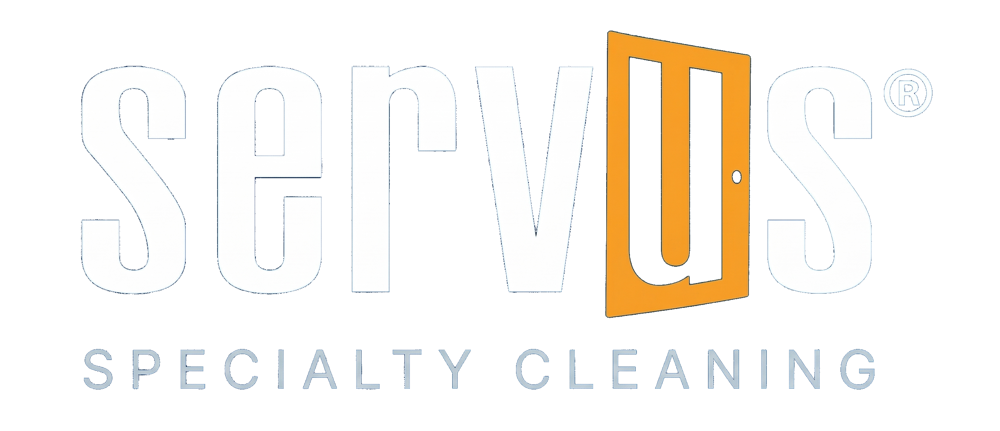

# Servus Training Course Master Template
## Complete Design System & Build Guide for All Servus Training Courses

> **Extracted from ALL live pages** of the Servus Professional Carpet Cleaning Training Course (April 2026). This is the **single source of truth** for building any new Servus training course. Every design token, component, page structure, and interaction is documented here. All future courses MUST follow this template exactly.

---

## Source Repository & Deployment

| Key | Value |
|-----|-------|
| **Repo** | `leanddouglas/servus-training` |
| **GitHub Pages** | `https://leanddouglas.github.io/servus-training/` |
| **Netlify** | `https://servus-training.netlify.app/` (Site ID: `5891f18b-9cdd-45cf-ac20-e71877c9222a`) |
| **Local dev** | `npx serve ./servus-training -l 3000` |

### Current Pages (Carpet Cleaning Course)
| Page | Path | Purpose |
|------|------|---------|
| Course Index | `course_index.html` | Landing page / Training Roadmap |
| Day 1 | `day1/index.html` | Fiber Identification |
| Day 2 | `day2/index.html` | Chemistry & Cleaning Agents |
| Day 3 | `day3/index.html` | Methods & Equipment |
| Day 4 | `day4/index.html` | Spotting & Stain Removal |
| Day 5 | `day5/index.html` | Professionalism & Certification Exam |
| FRP Reference | `sop/index.html` | 14 Field Reference Points + links to Operational SOPs |
| Residential SOP | `sop-operations/residential.html` | Standard Residential Carpet Cleaning SOP |
| Commercial SOPs | `sop-operations/commercial.html` | Commercial Maintenance + Emergency Response SOPs |
| Printable | `fiber_identification_printable.html` | Print-optimized fiber ID guide |
| Visual Samples | `burn-test-visual-samples.html` | Burn test reference images |
| Pre-Inspection Form | `assets/pre-inspection-form.html` | Standalone form (not linked — saved for Skedulo Plus) |

### Planned Future Courses
| Course | Duration | Status |
|--------|----------|--------|
| **Upholstery Cleaning** | 5 Days | Next |
| **Hard Surface Cleaning** | 5 Days | Planned |
| **Resilient Floor Care** | 5 Days | Planned |

Each course follows this exact template — same design, same structure, same branding.

---

## 1. Brand Color Palette (CSS Custom Properties)

```css
:root {
    --servus-navy: hsl(205, 78%, 19%);   /* #0a4875 — Primary brand */
    --servus-navy-dark: #004085;          /* Deep backgrounds */
    --servus-blue: #005a87;               /* Table headers, borders */
    --servus-blue-mid: #006ba1;           /* Module titles, gradient ends */
    --servus-accent: hwb(39 4% 3% / 0.991); /* #ff9900 — CTAs, accent bars */
    --servus-light-blue: #D3EEF5;         /* Cert strip background */
    --servus-pale-blue: #F0FCFF;          /* Table even rows, open accordion */
    --servus-cloud-blue: #F2F7FC;         /* Section backgrounds, callout boxes */
    --servus-off-white: #FAFAFA;          /* Video container background */
    --servus-dark: #313131;               /* Footer gradient start */
    --servus-text: #333333;               /* Body text */
    --servus-text-mid: #393939;           /* Secondary text */
    --servus-link: #0056b3;               /* Link color */
    --servus-success: #007bff;            /* Success states */
}
```

### Gradient Patterns
| Name | Value | Usage |
|------|-------|-------|
| Primary gradient | `linear-gradient(135deg, #0a4875 0%, #005a87 50%, #006ba1 100%)` | Headers, section headers |
| Dark gradient | `linear-gradient(135deg, #062d4a 0%, #0a4875 50%, #005a87 100%)` | Hero/page headers |
| Footer gradient | `linear-gradient(135deg, var(--servus-dark) 0%, #1a1a2e 100%)` | Footer |
| SOP badge gradient | `linear-gradient(135deg, #ff9900, #e68a00)` | SOP cards in Roadmap |

### Semantic Colors (inline, not in :root)
| Background | Text | Usage |
|-----------|------|-------|
| `#e3f2fd` | `#1565c0` | Inspect step, fiber foundations |
| `#fff3e0` | `#e65100` | Decide step, methods, spot/prof terms |
| `#e8f5e9` | `#2e7d32` | Action step, chemistry, grade-a |
| `#f3e5f5` | `#7b1fa2` | Complete step, professional terms |
| `#fce4ec` | `#c62828` | Spotting terms, safety alerts |
| `#4caf50` | — | Success borders, correct answers |
| `#e53935` | — | Error/incorrect answers |
| `#ff9800` | — | Warning/skipped |
| `#014870` | — | FRP system color (banners, chips) |

---

## 2. Font Stack

```css
/* Day pages + SOP pages */
font-family: 'Myriad Variable Concept', 'Inter', 'Segoe UI', Roboto, Helvetica, Arial, sans-serif;
line-height: 1.7;

/* Course Index page only */
font-family: 'Inter', 'Segoe UI', Roboto, Helvetica, Arial, sans-serif;
```
- **Google Font:** `Inter:wght@300;400;500;600;700;800` (add `900` for course index)

---

## 3. Logo & Branding

### Current Logo
- **File:** `assets/servus-specialty-cleaning-transparent.png` (989KB, transparent background)
- **Alt text:** `"Servus Group — Specialty Cleaning"`
- The logo includes "SPECIALTY CLEANING" text within the image itself — NO separate `hero-division` text element needed

### Logo CSS
```css
.hero-logo {
    width: 480px;
    max-width: 90%;
    margin-bottom: 24px;
    border-radius: 0;
}

/* Responsive */
@media (max-width: 768px) {
    .hero-logo { width: 320px; }
}
```

### Tagline
```html
<div class="hero-tagline">"Clean. Maintain. Enhance."</div>
```
```css
.hero-tagline {
    font-size: 1.35em;
    color: var(--servus-accent);   /* Orange #ff9900 */
    font-style: italic;
    font-weight: 400;
    margin-bottom: 28px;
}
```

### Important Logo Notes
- **NO `hero-division` div** — the logo image already contains "Specialty Cleaning"
- **Transparent background** — no background color mismatch
- **Same logo everywhere:** header, footer, pre-inspection form, printable page
- Footer logo: `style="height: 60px; margin-bottom: 8px;"`
- Form logo: `style="height: 70px; margin-bottom: 10px;"`

---

## 4. Page Structure Patterns

### 4A. Course Index (Landing Page)
```
<section class="hero">
  <div class="hero-content">
                       ← 480px transparent logo
    <div class="hero-tagline">                ← "Clean. Maintain. Enhance."
    <div class="hero-title-bar">              ← 80px x 4px orange accent bar
    <h2>                                       ← Course title
    <p class="hero-subtitle">                 ← Course description
    <div class="hero-stats">                  ← Flex row of stat cards
    <a class="hero-cta">                      ← Orange pill button
  </div>
</section>
<div class="cert-strip">
<section class="about-section reveal">
<section class="outcomes-section">
<section class="curriculum-section">         ← Training Roadmap with Day cards + SOP cards
<section class="instructor-section">         ← Dark gradient, blockquote
<section class="features-section">
<section class="final-cta">
<footer class="course-footer">               ← Logo image, contact, cert logos, dev credit
```

### 4B. Day Pages (Content Pages)
```
<div style="background-color: #0a4875; ..."> ← Top nav bar (Back to Course Hub + Forward link)
<header class="servus-header">               ← Gradient + grid SVG + bottom fade
                      ← Transparent logo
  <div class="hero-tagline">                 ← "Clean. Maintain. Enhance."
  <div class="accent-bar">                   ← 80px x 4px orange
  <h2>                                       ← Course title
  <div class="module-label">                 ← Day title
</header>
<div class="cert-strip">
<div class="content">                        ← max-width: 960px, padding: 30px 40px
  [h2.section-title / h3.module-title / callout / table / walkthrough / accordion / video / etc.]
</div>
<div class="glossary-widget">
<div class="page-nav">                       ← Bottom pill navigation
<div class="servus-footer">                  ← Logo image, contact, cert logos
```

### 4C. SOP Operations Pages
```
<div style="background-color: #0a4875; ..."> ← Top nav bar
<div class="servus-header">                  ← Same gradient header
  
  <div class="hero-tagline">
  <div class="accent-bar">
  <h2>Standard Operating Procedures</h2>
  <div class="module-label">                 ← SOP title
</div>
<div class="cert-strip">
<div class="content">
  <div class="sop-overview-card">            ← SOP ID + quick reference card
  <h2 class="section-title">Workflow Steps</h2>
  <div class="workflow-timeline">            ← Visual numbered timeline
  <div class="sop-section">                  ← 12 accordion sections (see Section 8 below)
</div>
<div class="page-nav">
<div class="servus-footer">
```

---

## 5. Shared Components (All Pages)

### Header (`servus-header`)
```css
.servus-header {
    position: relative;
    background: linear-gradient(135deg, #062d4a 0%, #0a4875 50%, #005a87 100%);
    color: white;
    padding: 80px 40px 60px;
    text-align: center;
    overflow: hidden;
}
/* SVG grid pattern overlay */
.servus-header::before {
    content: '';
    position: absolute;
    top: 0; left: 0; right: 0; bottom: 0;
    background: url("data:image/svg+xml,%3Csvg xmlns='http://www.w3.org/2000/svg' viewBox='0 0 1440 900'%3E%3Cdefs%3E%3Cpattern id='grid' width='60' height='60' patternUnits='userSpaceOnUse'%3E%3Cpath d='M 60 0 L 0 0 0 60' fill='none' stroke='rgba(255,255,255,0.03)' stroke-width='1'/%3E%3C/pattern%3E%3C/defs%3E%3Crect width='1440' height='900' fill='url(%23grid)'/%3E%3C/svg%3E");
    z-index: 0;
    pointer-events: none;
}
/* Fade-to-white at bottom */
.servus-header::after {
    content: '';
    position: absolute;
    bottom: -2px; left: 0; right: 0;
    height: 120px;
    background: linear-gradient(to top, #ffffff 0%, transparent 100%);
    z-index: 1;
}
.servus-header > * { position: relative; z-index: 2; }
```

### Header HTML (Day Pages)
```html
<div class="servus-header">
    
    <div class="hero-tagline">"Clean. Maintain. Enhance."</div>
    <div class="accent-bar"></div>
    <h2>[Course Title]</h2>
    <div class="module-label">Day [N]: [Module Title]</div>
</div>
```

### Top Navigation Bar
```html
<div style="background-color: #0a4875; padding: 12px 40px; display: flex; align-items: center; justify-content: space-between;">
    <a href="../course_index.html" style="color: #D3EEF5; text-decoration: none; font-size: 0.88em; font-weight: 500;">&larr; Back to Course Hub</a>
    <a href="../day2/" style="color: #D3EEF5; text-decoration: none; font-size: 0.88em; font-weight: 500;">Day 2: [Title] &rarr;</a>
</div>
```

### Certification Strip (`cert-strip`)
```html
<div class="cert-strip">
    <span class="cert-item">
        
        COR Certified
    </span>
    <span class="cert-divider">•</span>
    <span class="cert-item">IICRC S100 Compliant</span>
    <span class="cert-divider">•</span>
    <span class="cert-item">WorkSafeBC 2026</span>
    <span class="cert-divider">•</span>
    <span class="cert-item">CRI Standards</span>
</div>
```
- Background: `var(--servus-light-blue)` (#D3EEF5)
- **NEVER add ISSA** — certification not confirmed

### Footer (`servus-footer`) — Day Pages
```html
<div class="servus-footer">
    
    <p style="color: #ccc; margin: 4px 0 12px;">[Course Name]</p>
    <p style="color: #ccc; margin: 4px 0;"><strong>Contact:</strong> <a href="tel:604-435-1135" style="color: var(--servus-accent);">604-435-1135</a> | <a href="mailto:info@servusgroup.com" style="color: var(--servus-accent);">info@servusgroup.com</a></p>
    <p style="color: #ccc; margin: 4px 0;">160-21900 Westminster Hwy, Richmond BC V6V 2K3 | <a href="https://servusgrouplowermainland.com" target="_blank" style="color: var(--servus-accent);">servusgrouplowermainland.com</a></p>
    <div class="footer-certs">
        
        
        
    </div>
    <div class="compliance-text" style="font-size: 0.7em; max-width: 700px; margin: 10px auto 0; line-height: 1.4; opacity: 0.6;">This material is for Servus Group staff training and certification purposes only. All equipment and chemicals referenced are approved for use by Servus Group and comply with applicable safety standards (WHMIS, WorkSafeBC). Product recommendations and protocols reflect Servus Group&rsquo;s best practices and may vary based on site-specific conditions. Always consult equipment manuals and chemical Safety Data Sheets (SDS) before use.</div>
</div>
```

### Footer — Course Index ONLY (adds dev credit)
```html
<footer class="course-footer">
    
    <p style="margin: 4px 0 12px;">[Course Name]</p>
    <!-- ... same contact/address/certs ... -->
    <p style="margin-top: 14px; font-size: 0.75em; opacity: 0.4;">&copy; 2026 Servus Group. Developed by <strong>Douglas da Silva</strong></p>
</footer>
```

### Footer Notes
- **Logo image replaces text** — no `<strong>Servus Group</strong>` text
- **NO duplicate logo** in the `footer-certs` row (only COR, IICRC, CRI logos)
- **Dev credit** only on `course_index.html`
- Footer certs use `filter: brightness(0) invert(1)` for white appearance on dark background

### Bottom Page Navigation (`page-nav`)
```html
<div class="page-nav">
    <a href="../day1/" class="page-nav-btn nav-prev">
        <svg width="16" height="16" viewBox="0 0 24 24" fill="none" stroke="currentColor" stroke-width="2.5" stroke-linecap="round" stroke-linejoin="round"><polyline points="15 18 9 12 15 6"/></svg>
        Day 1: [Title]
    </a>
    <a href="../day3/" class="page-nav-btn nav-next">
        Day 3: [Title]
        <svg width="16" height="16" viewBox="0 0 24 24" fill="none" stroke="currentColor" stroke-width="2.5" stroke-linecap="round" stroke-linejoin="round"><polyline points="9 18 15 12 9 6"/></svg>
    </a>
</div>
```
```css
.page-nav {
    background: #f0f4f8;
    padding: 14px 40px;
    display: flex;
    align-items: center;
    justify-content: center;
    gap: 12px;
}
.page-nav-btn {
    display: inline-flex;
    align-items: center;
    gap: 6px;
    padding: 12px 28px;
    border-radius: 50px;
    font-weight: 700;
    font-size: 0.95em;
    text-decoration: none;
    transition: all 0.2s;
    cursor: pointer;
}
.nav-prev { background: #e8edf2; color: #0a4875; }
.nav-next { background: #0a4875; color: white; }
```

---

## 6. Content Components

### Section Title (`section-title`)
```html
<h2 class="section-title">Section Name</h2>
```
```css
.section-title {
    color: var(--servus-navy);
    font-size: 1.6em;
    padding-bottom: 12px;
    border-bottom: 3px solid var(--servus-accent);
    margin-bottom: 24px;
}
```

### Module Title (`module-title`)
```html
<h3 class="module-title">Module Name</h3>
```
```css
.module-title {
    color: var(--servus-blue-mid);
    font-size: 1.15em;
    border-left: 4px solid var(--servus-accent);
    padding-left: 12px;
    margin: 20px 0 12px;
}
```

### Callout Box (`servus-callout`)
```html
<div class="servus-callout">
    <div class="callout-label">
        <svg ...></svg> Label Text
    </div>
    <p>Content text</p>
</div>
```
- Style: cloud-blue bg, 5px navy left border
- **Use inline SVG label approach** (Day 2 pattern — recommended for all new courses)

### Tables
```css
th { background: var(--servus-navy); color: white; }
tr:nth-child(even) { background: var(--servus-pale-blue); }
tr:hover { background: var(--servus-light-blue); }
```

### Glossary Terms (Inline)
```html
<span class="glossary-term">Term<span class="tooltip">Definition.</span></span>
```
- Dotted orange underline, CSS-only hover tooltip (navy bg, white text, 260px)

### Connector Text
```css
.connector-text {
    background: /* pale-blue gradient */;
    border-left: 4px solid var(--servus-accent);
    padding: 16px 20px;
}
```

### Video Container
```html
<div class="video-container">
    <iframe src="..." allowfullscreen></iframe>
</div>
```
- Off-white background, centered, responsive `padding-bottom: 56.25%`

---

## 7. FRP System (Field Reference Points — Training Quick-Reference)

> **History:** Originally called "SOPs" — renamed to "Field Reference Points (FRP)" to distinguish from real operational SOPs. These are quick-reference training points embedded in day pages.

### Overview
- **14 FRPs** numbered FRP-001 through FRP-014
- **5 Categories:** Forms, Protocols, Decision Trees, Procedures, Checklists
- **FRP Color:** `#014870` (solid navy, white text)
- **Dedicated page:** `sop/index.html` (folder name kept as `sop/` for URL stability)

### FRP Banner Component (Per Day Page)
```css
.sop-system-card { border: 1.5px solid #014870; border-radius: 10px; overflow: hidden; margin-bottom: 24px; background: #f8fafc; }
.sop-system-card-header { background: #014870; color: white; padding: 10px 18px; display: flex; align-items: center; gap: 10px; }
.sop-chip { color: #014870; ... }          /* Clickable <a href="#sop-XXX"> */
.sop-chip-num { background: #014870; color: white; ... }
.sop-section-tag { color: #014870; background: #e8f2f8; border: 1px solid #c5d9e6; ... }
```

### FRP Anchor System
| FRP | Name | Day |
|-----|------|-----|
| FRP-001 | Pre-Inspection Documentation | Day 1 |
| FRP-002 | Burn Test Protocol | Day 1 |
| FRP-003 | 8-Step Cleaning Protocol | Day 2 |
| FRP-004 | Rinse & Neutralization | Day 2 |
| FRP-005 | HWE Setup & Operation | Day 3 |
| FRP-006 | Pre-Run Equipment Checklist | Day 3 |
| FRP-007 | Encapsulation (Whittaker) | Day 3 |
| FRP-008 | Method Selection Decision Tree | Day 3 |
| FRP-009 | Spot vs Stain Classification | Day 4 |
| FRP-010 | Red Stain Emergency (Red Relief) | Day 4 |
| FRP-011 | Pet Damage Assessment | Day 4 |
| FRP-012 | Equipment Maintenance Schedule | Day 5 |
| FRP-013 | Safety & WHMIS Compliance | Day 5 |
| FRP-014 | IICRC S100 Reference Guide | Day 5 |

### FRP Notes
- CSS classes still use `.sop-*` (internal, not visible)
- Anchor IDs still use `id="sop-XXX"` (URL stability)
- Display text shows "FRP-001" through "FRP-014"

---

## 8. Operational SOP System (Real Day-to-Day Procedures)

> These are **real operational SOPs** following the owner's structured format — completely separate from the FRP training quick-reference items.

### SOP Page Structure
Each operational SOP page has **12 accordion sections** following this exact format:

| # | Section | Content |
|---|---------|---------|
| 01 | **Purpose** | What the process is for |
| 02 | **Scope** | What work scope means — definitions |
| 03 | **Workflow Steps** | Step-by-step flow (not technical execution) with Crew Leader vs Crew Member responsibilities |
| 04 | **Roles & Responsibilities** | Who does what — Crew Leader, Crew Member, Office/Dispatch |
| 05 | **Safety** | Signage, notes, customer communication |
| 06 | **Systems & Tools** | CRM, scheduling, communication tools used |
| 07 | **Communication** | Customer & internal updates, timing, templates |
| 08 | **Quality Checks** | Key checkpoints during the process |
| 09 | **Exceptions & Escalation** | How to handle issues, damage, changes |
| 10 | **Close-Out** | Final steps — photos, notes, reports, invoicing |
| 11 | **KPIs & Success Metrics** | Cycle time, completion rates, revenue/hour |
| 12 | **Reference** | Links to manuals, forms, checklists, FRPs |

### SOP Accordion Component
```css
.sop-section {
    margin-bottom: 8px;
    border: 1px solid #e8edf2;
    border-radius: 8px;
    overflow: hidden;
}
.sop-section-header {
    display: flex;
    align-items: center;
    gap: 12px;
    padding: 16px 20px;
    background: linear-gradient(135deg, #0a4875, #005a87);
    color: white;
    cursor: pointer;
    user-select: none;
    transition: background 0.2s;
    border-left: 4px solid #ff9900;
}
.sop-section-header:hover {
    background: linear-gradient(135deg, #083d65, #004a75);
}
.sop-section-header .section-number {
    background: rgba(255,255,255,0.15);
    padding: 2px 10px;
    border-radius: 4px;
    font-size: 0.8em;
    font-weight: 700;
}
.sop-section-header h3 { margin: 0; font-size: 1em; font-weight: 600; flex: 1; }
.sop-section-header .section-toggle { transition: transform 0.3s; }
.sop-section-header.active .section-toggle { transform: rotate(180deg); }
.sop-section-body { display: none; padding: 20px 24px; background: white; font-size: 0.93em; }
.sop-section-body.open { display: block; }
```

### SOP Accordion HTML (Example)
```html
<div class="sop-section">
    <div class="sop-section-header active">
        <span class="section-number">01</span>
        <h3>Purpose</h3>
        <svg class="section-toggle" width="18" height="18" viewBox="0 0 24 24" fill="none" stroke="currentColor" stroke-width="2.5" stroke-linecap="round" stroke-linejoin="round"><polyline points="6 9 12 15 18 9"/></svg>
    </div>
    <div class="sop-section-body open">
        <p>[Section content here]</p>
    </div>
</div>
```

### SOP Accordion Toggle JS
```html
<script>
document.querySelectorAll('.sop-section-header').forEach(header => {
    header.addEventListener('click', () => {
        header.classList.toggle('active');
        const body = header.nextElementSibling;
        body.classList.toggle('open');
    });
});
</script>
```

### SOP Overview Card (Top of SOP page)
```html
<div class="sop-overview-card">
    <div class="sop-overview-header">
        <div>
            <span class="sop-id-badge">SOP-RES-001</span>
            <h2>Standard Residential Carpet Cleaning</h2>
        </div>
    </div>
    <div class="sop-overview-body">
        <div class="sop-quick-ref">
            <div class="ref-item"><span class="ref-label">Effective</span><span>April 2026</span></div>
            <div class="ref-item"><span class="ref-label">Owner</span><span>Operations Manager</span></div>
            <div class="ref-item"><span class="ref-label">Applies To</span><span>All carpet cleaning crew</span></div>
        </div>
    </div>
</div>
```

### SOP Numbering Convention
| Code | Meaning | Example |
|------|---------|---------|
| SOP-RES-001 | Residential SOP | Standard Residential Carpet Cleaning |
| SOP-COM-001 | Commercial SOP | Commercial Carpet Maintenance Program |
| SOP-COM-002 | Commercial SOP | Spot & Stain Emergency Response |
| SOP-UPH-001 | Upholstery SOP | *(Future — Upholstery course)* |
| SOP-HRD-001 | Hard Surface SOP | *(Future — Hard Surface course)* |
| SOP-RFL-001 | Resilient Floor SOP | *(Future — Resilient Floor Care course)* |

### SOP Workflow Timeline Component
```html
<div class="workflow-timeline">
    <div class="timeline-step">
        <div class="step-number">1</div>
        <div class="step-content">
            <h4>Step Title</h4>
            <p>Step description</p>
        </div>
    </div>
    <!-- repeat for each step -->
</div>
```

### SOP KPI Cards
```html
<div class="kpi-grid">
    <div class="kpi-card">
        <div class="kpi-value">≤ 15 min</div>
        <div class="kpi-label">Arrival to Setup Complete</div>
    </div>
    <!-- repeat for each KPI -->
</div>
```

### Current Carpet Cleaning SOPs
| SOP | Page | Steps |
|-----|------|-------|
| SOP-RES-001: Standard Residential Carpet Cleaning | `sop-operations/residential.html` | 11 steps |
| SOP-COM-001: Commercial Carpet Maintenance Program | `sop-operations/commercial.html` | 9 steps |
| SOP-COM-002: Spot & Stain Emergency Response | `sop-operations/commercial.html` | 8 steps |

---

## 9. SOP Cards in Training Roadmap

SOP cards appear in `course_index.html` after the Day 5 card:

```html
<!-- SOP OPERATIONS: RESIDENTIAL -->
<a href="sop-operations/residential.html" class="day-card sop-card reveal">
    <div class="day-number" style="background: linear-gradient(135deg, #ff9900, #e68a00);">
        <span class="dn-label">SOP</span>
        <span class="dn-num" style="color: #0a4875;">RES</span>
    </div>
    <div class="day-info">
        <div class="day-title">Residential Carpet Cleaning SOP</div>
        <div class="day-subtitle">Description text...</div>
        <div class="day-modules">
            <span class="mod-tag">Workflow</span>
            <span class="mod-tag">Roles</span>
            <span class="mod-tag">Safety</span>
            <span class="mod-tag">Quality Checks</span>
            <span class="mod-tag">KPIs</span>
        </div>
    </div>
    <div class="day-meta">
        <div class="meta-item">
            <svg ...></svg> 11 Steps
        </div>
        <div class="meta-item">
            <svg ...></svg> 12 Sections
        </div>
    </div>
</a>
```

Key differences from Day cards:
- `style="background: linear-gradient(135deg, #ff9900, #e68a00);"` — orange gradient instead of navy
- `<span class="dn-num" style="color: #0a4875;">` — navy text on orange
- `<span class="dn-label">SOP</span>` — "SOP" instead of "Day"

---

## 10. Interactive Components

### Walkthrough Engine (Day 1, 2, 4)
- Step-based state machine with decision trees
- Container: `.walkthrough-container` (cloud-blue bg, 2px blue border)
- Header: `.wt-header` (navy gradient, step counter pill)
- Breadcrumbs: `.wt-crumb` — `.completed` (green), `.current` (orange pulse), `.locked` (gray)
- Step types: inspect (blue), decide (orange), action (green), complete (purple)
- Choice buttons: `.wt-choice-btn.yes` (green) / `.wt-choice-btn.no` (red)
- **Breadcrumb fix:** Hide when `stepPath.length ≤ 1` to avoid duplicate first-step breadcrumb

### Accordion (Day 3+)
```css
.accordion-item {
    cursor: pointer; margin-bottom: 12px; padding: 14px 16px;
    background: white; border: 1px solid #d8d8d8;
    border-left: 4px solid var(--servus-navy);
    border-radius: 0 4px 4px 0; transition: all 0.2s;
}
.accordion-item.open {
    background: var(--servus-pale-blue);
    border-left-color: var(--servus-accent);
}
.accordion-body { max-height: 0; overflow: hidden; transition: max-height 0.3s ease; }
.accordion-item.open .accordion-body { max-height: 2000px; }
```
**JS:** `onclick="this.classList.toggle('open')"`

### Exam Engine (Day 5 — Final Day Only)
- Progress bar, section nav pills, question cards
- Category badges: `.cat-foundations` (blue), `.cat-chemistry` (green), `.cat-methods` (orange), `.cat-spotting` (red), `.cat-professional` (purple)
- Results dashboard: score hero (pass/fail), stats grid, section breakdown, certificate card
- `submitExam()`, `filterSection()`, `retryExam()` functions

### Glossary Widget (All Day Pages)
- `toggleGlossary()`, `filterG(cat, btn)`, `searchGlossary(query)`
- Category badges by day — see Section 12 below

---

## 11. Form-Only Print Mode

Used for in-page forms (like the pre-inspection form on Day 1) that should print without the rest of the page.

### CSS (inside `@media print`)
```css
/* Form-only print mode */
body.printing-form > *:not(.content),
body.printing-form .content > *:not(.form-print-wrapper),
body.printing-form .servus-header,
body.printing-form .cert-strip,
body.printing-form .servus-footer,
body.printing-form .page-nav,
body.printing-form .glossary-widget,
body.printing-form .back-link,
body.printing-form [style*="background-color: #0a4875"] {
    display: none !important;
}
body.printing-form .form-print-wrapper {
    border: none !important;
    margin: 0 !important;
    padding: 10px !important;
    -webkit-print-color-adjust: exact;
    print-color-adjust: exact;
}
body.printing-form .form-print-wrapper button {
    display: none !important;
}
body.printing-form .content {
    padding: 0 !important;
    margin: 0 !important;
    max-width: 100% !important;
}
```

### JavaScript
```javascript
function printForm() {
    document.body.classList.add('printing-form');
    window.print();
    window.onafterprint = function() {
        document.body.classList.remove('printing-form');
    };
    setTimeout(function() {
        document.body.classList.remove('printing-form');
    }, 5000);
}
```

### HTML Wrapper
```html
<div class="form-print-wrapper" style="background: var(--servus-cloud-blue); border: 2px solid var(--servus-blue); border-radius: 12px; padding: 30px; margin: 24px 0;">
    <!-- Form content here -->
    <button type="button" onclick="printForm()" style="background: var(--servus-navy); color: white; border: none; padding: 12px 32px; border-radius: 8px; font-size: 1em; font-family: inherit; cursor: pointer; font-weight: 600;">
        <svg ...></svg> Print This Form
    </button>
</div>
```

---

## 12. Glossary Category Badges

| Badge Class | Day(s) | Topic | Background | Text Color |
|-------------|--------|-------|-----------|------------|
| `.g-cat-fiber` | Day 1 | Fiber types | `#e3f2fd` | `#1565c0` |
| `.g-cat-tech` | Day 1, 2 | Technical | `#fff3e0` | `#e65100` |
| `.g-cat-test` | Day 1 | Testing | `#f3e5f5` | `#7b1fa2` |
| `.g-cat-chem` | Day 2, 3 | Chemistry | `#e8f5e9` | `#2e7d32` |
| `.g-cat-safe` | Day 2, 3 | Safety | `#fce4ec` | `#c62828` |
| `.g-cat-spot` | Day 4 | Spotting | `#fff3e0` | `#e65100` |
| `.g-cat-prof` | Day 5 | Professional | `#fff3e0` | `#e65100` |

---

## 13. Animations & Keyframes

| Name | Definition | Used In |
|------|-----------|---------|
| `fadeInDown` | opacity 0 + translateY(-20px) → visible | Hero logo |
| `fadeInUp` | opacity 0 + translateY(20px) → visible | Hero content, exam results |
| `expandBar` | width 0 → 80px | Title accent bar |
| `pulse` | box-shadow glow (orange) | Walkthrough current crumb |
| `slideIn` | opacity 0 + translateY(20px) → visible | Walkthrough steps |
| `countUp` | opacity 0 + scale(0.5) → scale(1) | Exam score number |
| `slideRight` | width 0% → actual | Exam score bars |
| `.reveal` → `.visible` | opacity 0 + translateY(30px) → visible | Scroll-triggered sections |

---

## 14. SVG Icon Standards

### Rules
- **NO emoji anywhere** — all icons MUST be inline SVG
- **Style:** Stroke-based, consistent stroke-width (2 or 2.5)
- **Sizes:** 16–24px depending on context
- **Colors:** Brand CSS variables or explicit brand hex colors
- **Alignment:** `vertical-align: -2px` to `-4px` with `margin-right: 4px–6px`

### Color by Context
| Context | Stroke Color |
|---------|-------------|
| Section headings | `var(--servus-navy)` or `#0a4875` |
| Dark/colored backgrounds | `white` or `rgba(255,255,255,0.7)` |
| Orange buttons | `white` |
| Success | `#4caf50` |
| Error | `#e53935` |
| Warning | `#ff9800` |
| Accent | `#ff9900` |
| Inherit | `currentColor` |

### Common Icons Reference
| Icon | Purpose | Key Element |
|------|---------|-------------|
| Grid tiles | Question Map | 4 `<rect>` in 2x2 |
| Bar chart | Performance | 3 vertical `<line>` |
| Clipboard | Recommendations | `<path>` + `<rect>` + `<line>` |
| Refresh | Retry | `<polyline>` arrows + `<path>` arc |
| Warning | Alerts | `<path>` triangle + `<line>` |
| Star | Awards | `<polygon points="12 2 15.09 8.26...">` |
| Check-circle | Pass/Strong | `<circle>` + `<polyline>` |
| X-circle | Fail/Weak | `<circle>` + 2 `<line>` |
| Chevron down | Accordion toggle | `<polyline points="6 9 12 15 18 9"/>` |

---

## 15. Responsive Breakpoints

| Breakpoint | Changes |
|-----------|---------|
| **768px** | Header padding 50px 20px 40px, logo 320px, h2 1.3em, walkthrough stacks, glossary full-width, day-card 2-column, exam stats 2x2 |
| **480px** (Index) | Hero min-height auto, tighter padding |

---

## 16. Print Styles

```css
@media print {
    body { max-width: 100%; padding: 0; }
    .servus-header, .servus-footer, .cert-strip {
        -webkit-print-color-adjust: exact;
        print-color-adjust: exact;
    }
    .walkthrough-container, table, .servus-callout,
    .cheat-sheet, .accordion-item, .scenario-card, hr {
        page-break-inside: avoid;
    }
    .glossary-widget { display: none; }
    .hero { min-height: auto; padding: 40px 20px; }
    .hero::after { display: none; }
    .day-card { break-inside: avoid; box-shadow: none; border: 1px solid #ddd; }
}
```

---

## 17. Assets

| File | Purpose |
|------|---------|
| `servus-specialty-cleaning-transparent.png` | **Primary logo** — transparent BG, used everywhere |
| `iicrc-logo.png` | IICRC certification logo |
| `cri-logo.png` | CRI Carpet & Rug Institute logo |
| `servus-cleaning-logo-colour.jpg` | Legacy color logo (kept for reference) |
| `servus-cleaning-logo-white.jpg` | Legacy white logo |
| `servus-logo-colour.jpg` | Legacy logo without "Cleaning" |
| `servus-logo-white.jpg` | Legacy white logo |
| `pre-inspection-form.html` | Standalone form for Skedulo Plus (NOT linked) |
| COR logo | External: `servusgrouplowermainland.com/wp-content/uploads/2014/07/go2HR-CORLogo-K-300x283.png` |

---

## 18. Standardized Contact Info

| Field | Value |
|-------|-------|
| **Company** | Servus Group |
| **Division** | Specialty Cleaning |
| **Tagline** | "Clean. Maintain. Enhance." |
| **Phone** | 604-435-1135 |
| **Email** | info@servusgroup.com |
| **Address** | 160-21900 Westminster Hwy, Richmond BC V6V 2K3 |
| **Website** | servusgrouplowermainland.com |
| **Dev credit** | Douglas da Silva (course_index only) |
| **Certifications** | COR, IICRC S100, WorkSafeBC 2026, CRI Standards |

---

## 19. CRITICAL RULES — Never Break These

1. **NEVER add ISSA** — certification not confirmed
2. **NEVER reference Dry Foam** — not a service Servus offers
3. **Email is `info@servusgroup.com`** — NOT info@servusgrouplowermainland.com
4. **Postal code is `V6V 2K3`** — use consistently
5. **Dev credit only on course_index** — not on day pages or SOP pages
6. **NO emoji** — all icons must be inline SVG (see Section 14)
7. **Tagline is "Clean. Maintain. Enhance."** — NOT "At Your Service"
8. **Logo is the transparent PNG** — NO `hero-division` text div
9. **Footer uses logo image** — NO `<strong>Servus Group</strong>` text
10. **NO duplicate logo in footer certs** — only COR, IICRC, CRI logos

---

## 20. How to Create a New Course

### Step-by-Step Build Guide

#### Phase 1: Set Up Course Structure
1. Create course folder: `[course-name]/` (e.g., `upholstery/`)
2. Copy `day1/index.html` as the base template for each day page
3. Copy `course_index.html` as the landing page template
4. Copy `sop/index.html` for the FRP reference page
5. Create `sop-operations/` folder for operational SOPs

#### Phase 2: Customize Content Pages (Days 1-5)
6. Update `<title>` and `<div class="module-label">` for each day
7. Replace content between `<div class="content">` and `</div>`
8. Use h2/h3/accordion/callout/table patterns from this template
9. Create course-specific glossary terms with appropriate category badges
10. Build walkthrough scenarios relevant to the new topic
11. Add exam section on Day 5 (copy Day 5 exam structure)

#### Phase 3: Create FRPs
12. Define quick-reference training points (numbered FRP-001+)
13. Add FRP banners and chips to day pages
14. Create FRP index page with links to day page anchors

#### Phase 4: Create Operational SOPs
15. Create SOP pages following the 12-section accordion format (Section 8)
16. Use SOP numbering convention (e.g., SOP-UPH-001 for Upholstery)
17. Include all 12 sections: Purpose, Scope, Workflow, Roles, Safety, Systems, Communication, Quality, Exceptions, Close-Out, KPIs, Reference

#### Phase 5: Update Navigation
18. Update `course_index.html` hero stats, day cards, and SOP cards
19. Set up top nav bar (Back to Course Hub + forward links)
20. Set up bottom page-nav pills between all pages
21. Link SOPs from FRP index page

#### Phase 6: Finalize
22. Verify all pages render correctly
23. Test navigation between all pages
24. Confirm responsive design at 768px and 480px
25. Verify print styles
26. Push to GitHub and deploy to Netlify

### Course-Specific SOP Numbering
| Course | FRP Prefix | SOP Prefix |
|--------|-----------|------------|
| Carpet Cleaning | FRP-001 to FRP-014 | SOP-RES, SOP-COM |
| Upholstery Cleaning | FRP-101+ | SOP-UPH |
| Hard Surface Cleaning | FRP-201+ | SOP-HRD |
| Resilient Floor Care | FRP-301+ | SOP-RFL |

---

*Template last updated: April 9, 2026. Extracted from all live pages of the Servus Professional Carpet Cleaning Training Course. This is the master reference for: **Upholstery Cleaning**, **Hard Surface Cleaning**, and **Resilient Floor Care** courses.*
